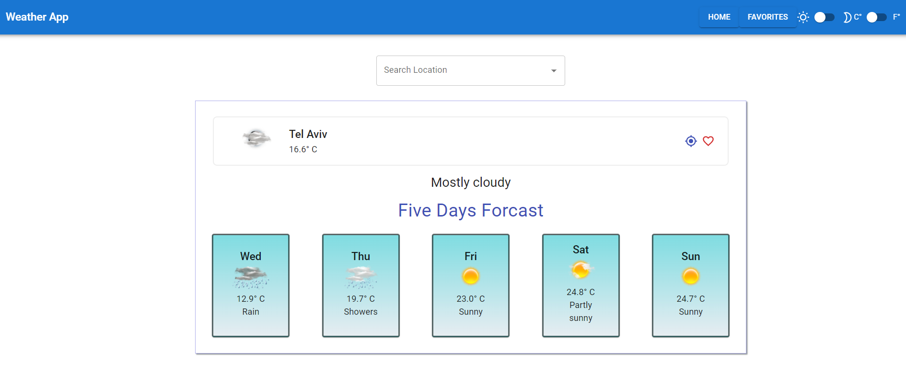
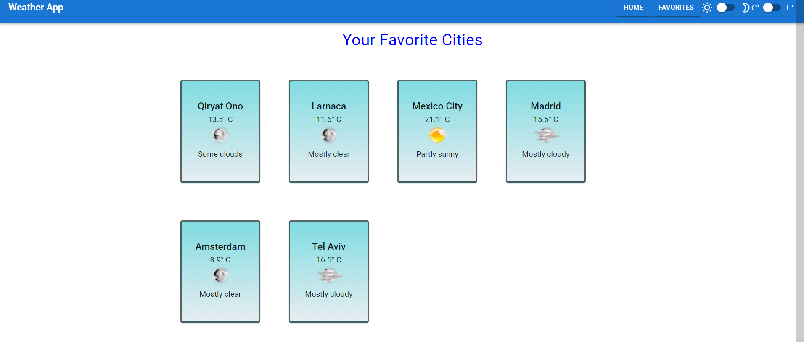
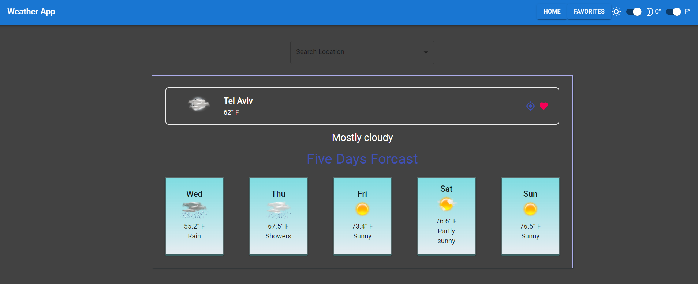

# weather application

Weather app that whows 5 days forecast in selected city.

## Overview

By using this app users can:

- Select city by writing the city name in the search bar
- See the forecast of the current location
- Mark the selected city as a favorite
- See all the favorite cities on the second page of the app and click on them to see the forecast
- Switch to dark mode
- Switch between CelciUs and Farnhait

### Screenshots

<!-- 

 -->

## Built with

- Creat React App
- AccuWeather APIs
- Redux-Toolkit for global state management in the app
- Axios for making HTTP Requests
- Material-UI- an open-source React component library

## How to run the project

1. Clone this project or download the files to your own machine
2. Install all the dependencies from the project with `npm install`
3. Setup your api key from [AccuWeather APIs](https://developer.accuweather.com/apis)
4. Run the app in the development mode with `npm start`
5. Open [http://localhost:3000](http://localhost:3000) to view it in the browser.
   The page will reload if you make edits.\
   You will also see any lint errors in the console.

## known issues

- slow loading of the app
- issues invloved third party api

## Learn More

You can learn more in the [Create React App documentation](https://facebook.github.io/create-react-app/docs/getting-started).

To learn React, check out the [React documentation](https://reactjs.org/).
